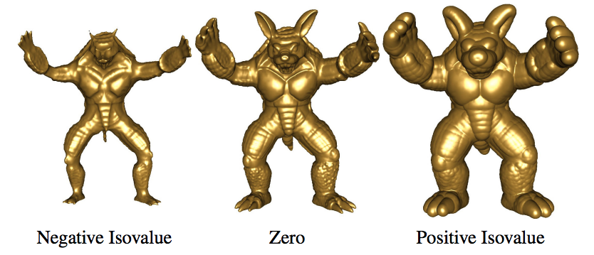
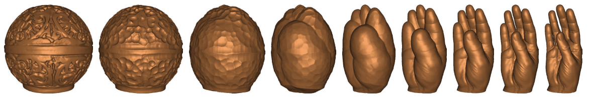

# Programming

The Functional Geometry system provides both a low-level and a high-level API.
* The high level API includes familiar operations like sphere(), translate()
  and intersection(),
  plus new operations like shell(), morph() and perimeter_extrude().
* The low level API allows users to directly define new primitive operations
  using functional representation.

The low level API is quite powerful. Most of the OpenSCAD geometry
primitives can be defined in a few hundred lines of OpenSCAD2.
That's very impressive, compared to the amount of code required to implement
these operations on a mesh.
The low level API is
also subtle and tricky. So you can define `sphere()`, `union()`, etc, with 3
lines of code per primitive, but they can be subtle and tricky lines of code.

This document is a tutorial introduction to the low level API,
which is illustrated by showing you how to define a lot of interesting
high level operations.
There's enough detail so that you can really wrap your head around
the idioms of creating geometry using Functional Representation.

## Benefits and Limitations

When compared to the mesh-based programming model of OpenSCAD,
the Functional Geometry API has both benefits and limitations.

* **expressive power** <br>
  A primary benefit of Functional Geometry is that you can define powerful new
  geometric primitives with only a few lines of OpenSCAD2 code.
  Most of OpenSCAD's geometry kernel can be implemented, quite simply,
  at user level. By contrast, programming these same primitives using a mesh
  is notoriously difficult, with lots of edge conditions to deal with,
  and a lot of additional complexity if you use floating point (as opposed
  to the slow and memory-inefficient rational numbers used by OpenSCAD).

* **direct access to the representation of shapes** <br>
  In OpenSCAD, shapes are opaque: you can't access their representation;
  you can't even query the bounding box, let alone access the vertexes and faces.
  This restriction is due to an engineering tradeoff: we want preview to be fast,
  and we don't generate the mesh representation of CSG operations during preview.
  If we were to provide access to the mesh during preview, then preview would become as slow as rendering.
  Functional Geometry has no such tradeoff, and much of the programming power is due
  to the fact that we provide full access to the underlying functional representation.

* **curved surfaces** <br>
  It's extremely easy to work with curved surfaces in Functional Geometry,
  something that is a major weakness of OpenSCAD.
  * A curved object is represented by its mathematical formula,
    which makes curved surfaces and organic forms easy to define with very little code.
  * Internally, a curved object is represented exactly. It's like programming in
    OpenSCAD with `$fn=∞`. Curved objects can be rendered in the preview window at full resolution,
    even for complex models.
    By contrast, in OpenSCAD, curved surfaces are represented by polygonal
    approximations that are chosen when the object is created, and errors accumulate as
    these curved surfaces are further transformed. In OpenSCAD, you must find
    a value of `$fn` that's high enough to achieve the print quality you want
    while still low enough to prevent OpenSCAD from getting too slow or crashing while
    you are working on the design.

* **no "non-manifold objects"** <br>
  The OpenSCAD rendering engine, based on CGAL, is very picky about "non-manifold objects",
  so you have to use tricks to perturb your model in ways to avoid these errors.
  The problem doesn't occur in preview mode, and it's not something you worry about
  in Functional Geometry either.

* **high level annoyances** <br>
  Of course, Functional Geometry has its own limitations.
  We will discover that the FG high level API has its own annoyances that affect
  the programming model.

* **low level annoyances** <br>
  The FG low level API has an ease of use problem, similar to `polyhedron` in OpenSCAD.
  It's possible to write a bad distance function for functional representation,
  which could cause error messages or rendering problems later, and it's hard to
  automatically detect and report these problems.

* **no `minkowski` or `hull`** <br>
  There's no efficient implementation of Minkowski Sum and Convex Hull.
  Of course, we could convert functional representation to a mesh, and run the
  mesh versions of these operations, but that's even slower than OpenSCAD.
  Even in OpenSCAD, these are slow operations that kill preview performance.
  Fortunately, there are good alternatives to the OpenSCAD idioms that
  use these operations, which preview quickly.

* **not a boundary representation** <br>
  Functional representation does not directly represent the boundary of an object in the
  same way that a mesh does. This will lead to compromises when what you really want is
  direct control over the mesh, for example in STL export. It may require you to
  make additional decisions to configure space/time/accuracy tradeoffs during mesh generation.
  I'm going to investigate a hybrid approach to mitigate this problem,
  but using mesh features will take away from the simplicity of Functional Geometry programming.

## Functional Representation (F-Rep)

The mathematical equation for a sphere of radius `r` is `x^2 + y^2 + z^2 = r^2`.

We can rewrite this as `x^2 + y^2 + z^2 - r^2 = 0`.

The above is an *implicit equation*,
from which we can derive the *implicit function*
```
f[x,y,z] = x^2 + y^2 + z^2 - r^2
```

`f[x,y,z]` is:
* zero if the point [x,y,z] is on the boundary of the sphere
* negative if the point is inside the sphere
* positive if the point is outside the sphere

More generally, `f[x,y,z]` is the distance of the point from the sphere's boundary,
and `f` is called a *signed distance function*, a *distance function*, or a *distance field*.
The 3D surface defined by `f[x,y,z]==0` is an *isosurface*.
`f` represents a sphere of radius `r` in F-Rep.
(Although we use a slightly different definition in practice; see below.)

There's one more wrinkle.
In F-Rep, a distance function maps every point in 3D space onto a signed distance.
This representation is not restricted to representing finite geometrical objects.
It can also represent infinite space-filling patterns.
For examples, try a Google image search on
[k3dsurf periodic lattice](https://www.google.ca/search?q=k3dsurf+periodic+lattice&tbm=isch).
These infinite patterns are useful in 3D modelling:
you can intersect them or subtract them from a finite 3D object.

An essay on
[the mathematical basis of F-Rep](https://christopherolah.wordpress.com/2011/11/06/manipulation-of-implicit-functions-with-an-eye-on-cad/)
by Christopher Olah, inventor of ImplicitCAD.

## Low Level API
In OpenSCAD2, functional geometry has both a low-level and a high-level API.
* The high level API includes familiar operations like sphere(), translate() and intersection(),
  plus exciting new operations like shell() and perimeter_extrude().
* The low level API allows users to directly define new primitive operations
  using distance functions, and is perhaps the analogue of polyhedron() for B-Rep.

`3dshape(f([x,y,z])=..., bbox=[[x1,y1,z1],[x2,y2,z2]])`
> Returns a functional 3D shape, specified by a distance function.
> The bounding box is required for implementation reasons: there is
> no cheap way to compute it from `f`. The bounding box can be larger
> than necessary, but any tendrils of the shape that extend beyond
> the bounding box will be truncated.

`3dpattern(f([x,y,z])=...)`
> Returns a potentially infinite, space filling 3D pattern.
> You can intersect this with a 3D shape, or subtract it from a 3D shape,
> which yields another finite 3D shape. But you can't export a 3D pattern
> to an STL file.

`2dshape` and `2dpattern` are the 2 dimensional analogues of the above.

The low level API contains utility operations that are used
to define new operations that map shapes onto shapes.
Shapes can be queried at run-time for their distance function
and their bounding box.

`shape.f`
> the distance function of a shape

`shape.bbox`
> the bounding box of a shape

Although my starting point for this design was ImplicitCAD and Antimony,
I found bugs in both programs that required an architectural change to fix.
So in the Functional Geometry design, bbox is a function...

## Weird Shapes
A distance function can express an arbitrary set of points in 3-space,
which could be a 2D surface, a 1D path, an isolated 0D point,
or a [fractal with a non-integer Hausdorff dimension](https://en.wikipedia.org/wiki/List_of_fractals_by_Hausdorff_dimension).
It's not limited to well formed, finite 3D solids.
* The upside is that this is very powerful and expressive. We can make productive use of weird shapes,
  and I haven't explored all of the possibilities yet.
* The downside is that we are giving users the ability to create pathological, malformed distance functions,
  and we have little ability to detect a malformed function and issue an error message.
  So we need to ensure that preview, STL export and SVX export produce some kind of valid result
  even if the distance function is pathological. We can't enter an infinite loop, crash, or export
  a non-manifold STL file.

Infinite space filling patterns are useful. They can be intersected with or subtracted from finite 3D solids.
Existing functional geometry systems make good use of this.
My insight is that we should use the bounding box [[-inf,-inf,-inf],[inf,inf,inf]] if the pattern is infinite in all directions. An infinite cylinder extending along the Z axis, with unit radius, would have bounding box [[-1,-1,-inf],[1,1,inf]]. Following this strategy, the intersection of the X, Y and Z cylinders would have a finite bbox with no special case code. is_finite(shape) tests the bounding box to determine if a shape is finite.

The empty set is a useful pattern. In ImplicitCAD, the bbox for the empty set is [[0,0,0],[0,0,0]], and there is ugly special case code in union to ignore empty shapes when computing the bbox for a union. Perhaps a better bbox for the empty shape is [[inf,inf,inf],[-inf,-inf,-inf]]. This has a height, width and depth of -inf, and may turn out to work correctly in bbox calculations with no special case code. Check and see when the Tutorial is complete. is_empty(shape) returns true if the height, width or depth of the bbox is <= 0.

A 2D object occupying the X-Y plane is directly expressible, without introducing a special type for 2D shapes,
or introducing a "2D subsystem".
```
square(n) = cuboid([n,n,0]);
```
We can test for a 2D object: minz and maxz are 0, width and depth are > 0.
So can we use this representation without any special casing? Do all of the polymorphic shape operators work
correctly on this representation without special casing? I think preview would work.

The PLASM language supports 1D shapes, and these are commonly used. A 3D cylinder is constructed as the cross-product
of a 1D line segment by a 2D circle. This would also work in Functional Geometry.
So this is something to play with in the future. Nothing new needs to be added to support this.

## Primitive Shapes
Here I'll define 3 primitive shapes: sphere, cuboid and cylinder.
The main lesson will be learning how to write a distance function.

```
sphere(r) = 3dshape(
    f([x,y,z]) = sqrt(x^2 + y^2 + z^2) - r,
    bbox=[[-r,-r,-r],[r,r,r]]);
```

In the F-Rep section, I said that `f([x,y,z]) = x^2 + y^2 + z^2 - r^2`
is a distance function for a sphere, so why did we change it?

There are many different ways to write a distance function that produce the same visible result.
The main requirement is that the isosurface of the distance function at 0
(the set of all points such that f[x,y,z] == 0)
is the boundary of the desired object, and there are infinitely many functions that satisfy this
requirement for any given shape.

But the isosurface at 0 is not the only thing you need to consider.
A distance function defines an infinite family of isosurfaces,
and they are all important, particular when you use the `shell` primitive.
Consider
```
sp = sphere(10);
```
`sp.f` is the distance function. Because of the way we defined `sphere`,
the isosurface of `sp.f` at -1 is a sphere of radius 9, the isosurface at 1
is a sphere of radius 11, and so on. All of the isosurfaces of `sp` are spheres.
As a result, `shell(1) sp` will return a spherical shell with outer radius 10
and inner radius 9. The `shell` operator provides direct access to the other isosurfaces.
(See the Shell section, which is later.)

```
cuboid(sz) = 3dshape(
  f([x,y,z]) = max([abs(x-sz.x/2), abs(y-sz.y/2), abs(z-sz.z/2)]),
  bbox=[ [0,0,0], sz ]);
```
I have similar comments for `cuboid`.
The distance function is designed so that all of the isosurfaces of a given
cuboid are nested cuboids, and `shell` works as expected.

Here's a thought experiment. Consider defining the distance function for `cuboid`
so the the distance to the boundary is measured in millimeters along a vector that points to the centre.
With this definition, only the isosurface at 0 would be a true cuboid. The isosurfaces at positive values
would have increasingly convex sides, so that at large values, the surface would approach a sphere.
The isosurfaces at negative values would have increasingly concave sides.
This behaviour would be visible using `shell`.

Note the use of `max` in the distance function for `cuboid`.
Generally speaking, if your distance function computes the max of a function of `x` and a function of `y`,
then your shape will have a right angle between the X and Y axes.
Read [Olah's essay](https://christopherolah.wordpress.com/2011/11/06/manipulation-of-implicit-functions-with-an-eye-on-cad/) for more discussion of this.

```
cylinder(h,r) = linear_extrude(h=h) circle(r);
```

```
circle(r) = 2dshape(
    f([x,y]) = sqrt(x^2 + y^2) - r,
    bbox=[[-r,-r],[r,r]]);
```

```
linear_extrude(h)(shape) = 3dshape(
    f([x,y,z]) = max(shape.f(x,y), abs(z - h/2) - h/2),
    bbox=[ [shape.bbox[0].x,shape.bbox[0].y,-h/2], [shape.bbox[1].x,shape.bbox[1].y,h/2] ]);
```
> The result of `linear_extrude` is centred.

The distance function for `linear_extrude` computes the max
of a function of x & y with a function of z,
and the result is a right angle between the X/Y plane and the Z axis.
See above.

## Translation
translate(), align(), pack???.
No need for center= options.

## Shells and Isosurfaces

### `shell(n) shape`
hollows out the specified shape, leaving only a shell of the specified
thickness.
An analogy is 3D printing a shape without infill.

```
shell(w)(shape) = 3dshape(
  f(p) = abs(shape.f(p) + w/2) - w/2,
  bbox = shape.bbox );
```
Explanation:
* `f(p) = abs(shape.f(p))` is the zero-thickness shell of `shape`.
* `f(p) = abs(shape.f(p)) - n` (for positive n) is a shell of thickness `n*2`,
  centered on the zero-thickness shell given above.
* `f(p) = shape.f(p) + n` (for positive n) is the isosurface of `shape` at `-n`
  (it's smaller than `shape`)

### `inflate(n) shape`
returns the isosurface of `shape` at value `n`.
Positive values of `n` create a larger version of `shape`,
`n==0` is the identity transformation,
and negative values "deflate" the shape.
This is different from the scale transformation; it's more like
inflating a shape like a balloon, especially for non-convex objects.


<br>[image source](http://www.gpucomputing.net/sites/default/files/papers/2452/Bastos_GPU_ADF_SMI08.pdf)

```
inflate(n)(shape) = 3dshape(
  f(p) = shape.f(p) - n,
  bbox=[ shape.bbox[0]-n, shape.bbox[1]+n ]);
```
TODO: is the bbox calculation correct in all cases? No, not for non-isotropic scaling.
The bbox could be bigger than this.
Use f to compute the bbox from shape.bbox using ray-marching.

## Scaling
Scaling is tricky. Several functional geometry systems get it wrong?

### `isoscale(s) shape`
This is an isotropic scaling operation:
it scales a shape by the same factor `s` on all 3 axes,
where `s` is a positive number.
The code is easier to understand than for non-isotropic scaling.

```
isoscale(s)(shape) = 3dshape(
  f(p) = s * shape.f(p / s),
  bbox = s * shape.bbox
);
```

Suppose that the distance function
was instead `f(p)=shape.f(p/s)`,
as it is in Antimony. We don't multiply the result by `s`.
This is good enough to scale the isosurface at 0,
which means the scaled shape will render correctly.
But the other isosurfaces will be messed up. Why?
* Suppose s > 1. Eg, s==2 and we are scaling a centred sphere with radius 3.
  We want the result to be a sphere with radius 6.
  If we pass in p=[6,0,0], that's converted to p/s = [3,0,0] before passed to the sphere's distance function,
  which then returns 0, indicating that p is on the boundary. Good.
  If we pass in p=[8,0,0], that's converted to p/s = [4,0,0], then shape.f(p/s) returns 1.
  This indicates we are a minimum of 1 mm from the boundary, which is satisfies
  the ray-march property. However, the inflate property is not satisfied, since the
  bounding box returned by `inflate(1)scale(2)sphere(3)` will be too small.
* Suppose s < 1.
  The ray-march property fails, but the inflate property is satisfied.
  

### Negative Scale Factor
In OpenSCAD, a negative scaling factor passed to the scale() operator
will cause a reflection about the corresponding axis. This isn't documented,
but it is a natural consequence of how scaling is implemented by an affine transformation matrix.

The scale operators discussed in this document don't work that way: a negative scaling factor
results in garbage.

### `scale([sx,sy,sz]) shape`
Non-isotropic scaling is hard ...

I don't see a way to implement non-isotropic scaling in a way
that satisfies both the ray-march and the inflate properties.
The system needs to change.

the effect of non-isotropic scaling on `shell`. Need for `spheroid`.

```
getImplicit3 (Scale3 s@(sx,sy,sz) symbObj) =
    let
        obj = getImplicit3 symbObj
        k = (sx*sy*sz)**(1/3)
    in
        \p -> k * obj (p ⋯/ s)
getBox3 (Scale3 s symbObj) =
    let
        (a,b) = getBox3 symbObj
    in
        (s ⋯* a, s ⋯* b)
```

```
scale(s)(shape) = 3dshape(
  f(p) = (s.x*s.y*s.z)^(1/3) * shape.f(p / s),
  bbox = s * shape.bbox
);
```

explanation:
* `f0(p) = shape.f(p/s)` correctly scales the isosurface at 0,
  so the shape will render correctly.
  But the other isosurfaces will be messed up,
  because the distances between isosurfaces will also be scaled.
  So `f0` isn't a valid distance function:
  it will cause `shell` and `inflate` to not work, in some cases.
* ImplicitCAD multiplies f0 by k=cube_root(s.x * s.y * s.z)
  to get a valid distance function. I don't understand.
  Suppose s=[27,1,1]. Then k=3. How can this be correct?
* Antimony just uses `f0`; it doesn't even try to fix the other
  isosurfaces. I don't think the correct code is even expressible.

Antimony:
```
def scale_x(part, x0, sx):
    # X' = x0 + (X-x0)/sx
    return part.map(Transform(
        '+f%(x0)g/-Xf%(x0)gf%(sx)g' % locals()
                if x0 else '/Xf%g' % sx,
        'Y',
        '+f%(x0)g*f%(sx)g-Xf%(x0)g' % locals()
                if x0 else '*Xf%g' % sx,
        'Y'))
def scale_xyz(part, x0, y0, z0, sx, sy, sz):
   # X' = x0 + (X-x0)/sx
   # Y' = y0 + (Y-y0)/sy
   # Z' = z0 + (Z-z0)/sz
   # X = x0 + (X'-x0)*sx
   # Y = y0 + (Y'-y0)*sy
   # Z = z0 + (Z'-z0)*sz
   return part.map(Transform(
      '+f%(x0)g/-Xf%(x0)gf%(sx)g' % locals(),
      '+f%(y0)g/-Yf%(y0)gf%(sy)g' % locals(),
      '+f%(z0)g/-Zf%(z0)gf%(sz)g' % locals(),
      '+f%(x0)g*-Xf%(x0)gf%(sx)g' % locals(),
      '+f%(y0)g*-Yf%(y0)gf%(sy)g' % locals(),
      '+f%(z0)g*-Zf%(z0)gf%(sz)g' % locals()))
Shape Shape::map(Transform t) const
{
    return Shape("m" + (t.x_forward.length() ? t.x_forward : "_")
                     + (t.y_forward.length() ? t.y_forward : "_")
                     + (t.z_forward.length() ? t.z_forward : "_") + math,
                 bounds.map(t));
}
```
The scale functions also do translation, so you can scale an object locally without moving its origin point.
With the translation removed, we get
```
   # X' = X/sx
   # X = X'*sx
```
Antimony gets it wrong. It doesn't fix up the

## CSG Operations
everything, nothing, complement,
union, intersection, difference

```
complement(s) = 3dshape(
  f(p) = -s.f(p)
  bbox = [[-inf,-inf,-inf],[inf,inf,inf]] );
```
> Convert a shape or pattern to its inverse: all points inside the object
> are now outside, and vice versa.

```
union(s1,s2) = 3dshape(
    f(p) = min(s1.f(p), s2.f(p)),
    bbox=[ min(s1.bbox[0],s2.bbox[0]), max(s1.bbox[1],s2.bbox[1]) ]);
```
> Simplest case of a union. ImplicitCAD uses special case code where the
> min and max in the bbox calculation ignore empty bounding boxes, but I've
> omitted that for clarity.

meaning of 'max' and 'min' in a distance function

Note: ImplicitCAD and Antimony use max for union and min for intersection.
Although this is a common implementation, [Schmitt 2002]
(http://grenet.drimm.u-bordeaux1.fr/pdf/2002/SCHMITT_BENJAMIN_2002.pdf)
says "it is well known that using min/max functions for set-theoretic
operations causes problems in further transformations of the model due to C1 discontinuity of
the resulting function (see Fig. 1.3). Further blending, offsetting, or metamorphosis can result
in unnecessary creases, edges, and tearing of such an object." (page 26, and figure 1.3 on page 20).
His solution is to use an alternative function, one which is differentiable.
My interpretation is that you need to round any sharp edges and add fillets to sharp corners
to avoid this alleged problem. I'm going to wait and see if we can actually detect a problem
once we have working code, before worrying about a fix.

## Rounded edges and Fillets
rcuboid, runion

```
rcuboid(r,sz) = 3dshape(
  f([x,y,z]) = rmax(r, [abs(x-sz.x/2), abs(y-sz.y/2), abs(z-sz.z/2)]),
  bbox=[ [0,0,0], sz ]);
```
> Cuboid with rounded corners (radius=r) from ImplicitCAD.
> All ImplicitCAD primitives that generate sharp corners have a rounding option.
> `rmax` is a utility function for creating rounded corners.

```
runion(r,s1,s2) = 3dshape(
    f(p) = rmin(r, s1.f(p), s2.f(p)),
    bbox=[ min(s1.bbox[0],s2.bbox[0])-r, max(s1.bbox[1],s2.bbox[1])+r ]);
```
> Create fillets! ImplicitCAD rounded union with radius `r`. (Why is the bbox padded by r?)
Example:
  ```
  runion(r=8,
  	cube([40,40,20]),
  	translate([0,0,20]) cube([20,20,30]))
  ```


## Perimeter_extrude

## Infinite Patterns
gyroid, infinite replication grid, etc

## Morphing
"Distance fields are also commonly used for
shape metamorphosis. Compared to mesh-based morphing
techniques, volume-based morphing is easier to implement
and can naturally morph surfaces of different genus."
[[Bastos 2008](http://www.gpucomputing.net/sites/default/files/papers/2452/Bastos_GPU_ADF_SMI08.pdf)].

Here's a simple morph operator based on linear interpolation
of the distance functions:


<br>[image source](http://www.gpucomputing.net/sites/default/files/papers/2452/Bastos_GPU_ADF_SMI08.pdf)

```
morph(r,s1,s2) = 3dshape(
  f(p) = interp(r, s1.f(p), s2,f(p)),
  bbox = interp(r, s1.bbox, s2.bbox)
);
interp(r,a,b) = a + (b - a)*r;
```
`r` normally ranges from 0 to 1, where 0 returns s1, 1 returns s2.
But values <0 or >1 can also be used.

"Unfortunately, in most cases simple interpolation is
unable to provide convincing metamorphoses, as it does not
preserve or blend corresponding shape features. In order to
improve morphing quality, we could use a warp function
to guide the distance field interpolation, as proposed by
Cohen-Or 'Three dimensional distance field metamorphosis'"
[[Bastos 2008](http://www.gpucomputing.net/sites/default/files/papers/2452/Bastos_GPU_ADF_SMI08.pdf)].
